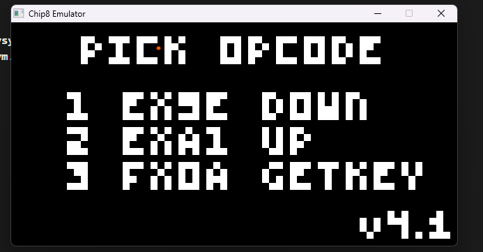

# amazing chip8 emulator 
written in about 2.69 hours. 




# usage
```bash
g++ main.cpp display.cpp emulator.cpp -I"SDL2/i686-w64-mingw32/include" -L"SDL2/i686-w64-mingw32/lib" -Wall -lmingw32 -lSDL2main -lSDL2; ./a.exe .\test_roms\<your-rom>
```

enjoy.